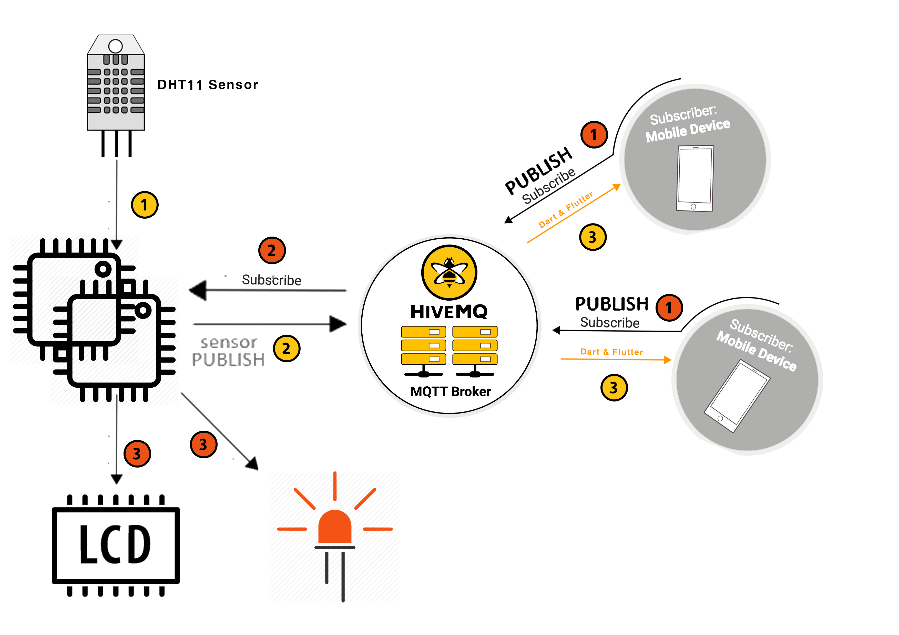
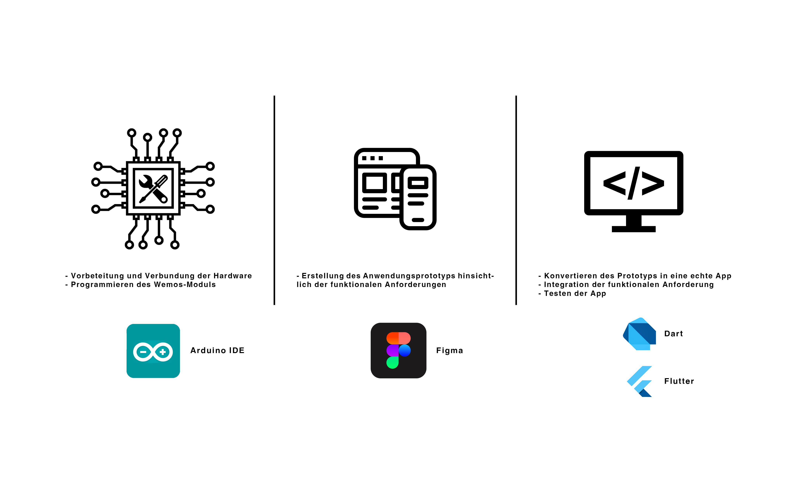
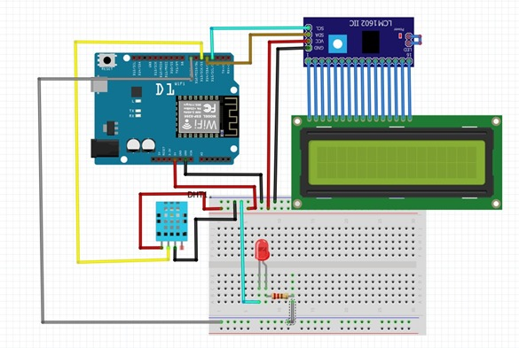

# dht-sensor-data-on-flutter
Display humidity and temperature sensor data on mobile with an app built in flutter

### Table of contents

- [Description](#description)
- [How to use](#how-to-use)
---

## Description

Our project is about enabling the connection between two [**Wemos modules ESP8266**](https://de.wikipedia.org/wiki/ESP8266) at different locations.
The project deals with simple sensors, we try to make the concept of data transfer easier with the current programming languages and frameworks.
This means that the data from an X-Sensor that is connected to X-Wemos can be transmitted without great effort and other data can be received by Y-Wemos.

The exchanged data is visualized by a  **mobile phone application ( Android / IOS )**. All received sensor data will be shown on an LCD connected to an X-Wemos.

### Technology scheme

## Work steps

---

## How to use

### Mobile app

In order to edit or run the Flutter project, follow this steps:

1. Install [git](https://git-scm.com/), [Flutter](https://flutter.dev/), and an editor recommended by Flutter.
2. Clone the github repository by entering the command in the terminal or command line: `git clone https://github.com/ma7amad4088/dht-sensor-data-on-flutter.git`
3. Navigate to the "mobile_app" folder by entering the command in the terminal or command line: `cd dht-sensor-data-on-flutter/mobile_app/`
4. Run a device emulator.
5. To run the app, write in the terminal or command line: `flutter run`

### Wemos app
**Note:** The LCD and L2C are not necessary.

1. Design the electronic circuit shown in the picture:

2. Go to the folder of the [program with LCD and L2C](arduino/DHT_MQTT_L2C/DHT_MQTT_L2C.ino) or [program without LCD and L2C](arduino/DHT_MQTT/DHT_MQTT.ino)

3. Configure the WiFi SSID name and password in the program
4. Upload the code on the Wemos modules.

**IMPORTANT:**

Please note that the first program publish the messages to the `/infowemos2` topic, and the second to `/infowemos1`.

Please note that the first program subscribe the topic `/ledwemos2`, and the second `/ledwemos1`.

Please read the documentation of MQTT protocol or visit the [MQTT für Dummies](https://blog.doubleslash.de/mqtt-fuer-dummies/) .
